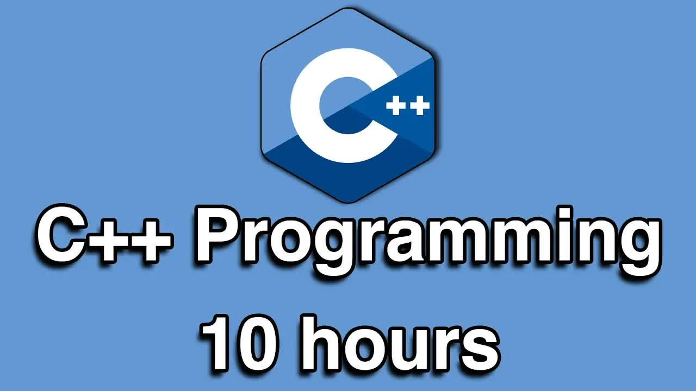

# C++-Programming-All-in-One-Tutorial-Series-(10-HOURS!)

  <picture>
    
  </picture>

 

---

## Video Information

| Property | Value |
|----------|-------|
| **Video Name** | `C++-Programming-All-in-One-Tutorial-Series-(10-HOURS!)` |
| **Original Link** | [YouTube Video](https://www.youtube.com/watch?v=_bYFu9mBnr4) |
| **Total Size** | **20 parts** - **880.41 MB** |
| **Quality** | **best** |
| **Status** | **Complete (100%)** |
| **Password Protected** | **NO** |

---

## Download Links

> ⬇️ Download **all parts**, then open `C++-Programming-All-in-One-Tutorial-Series-(10-HOURS!).zip` — the other parts are found automatically.

| # | File | Link |
|---|------|------|
| 1 | `C++-Programming-All-in-One-Tutorial-Series-(10-HOURS!).z01` | [Download](https://raw.githubusercontent.com/alirezamecheng/Ourtube-original/main/videos/C%2B%2B-Programming-All-in-One-Tutorial-Series-%2810-HOURS%21%29/C%2B%2B-Programming-All-in-One-Tutorial-Series-%2810-HOURS%21%29.z01) |
| 2 | `C++-Programming-All-in-One-Tutorial-Series-(10-HOURS!).z02` | [Download](https://raw.githubusercontent.com/alirezamecheng/Ourtube-original/main/videos/C%2B%2B-Programming-All-in-One-Tutorial-Series-%2810-HOURS%21%29/C%2B%2B-Programming-All-in-One-Tutorial-Series-%2810-HOURS%21%29.z02) |
| 3 | `C++-Programming-All-in-One-Tutorial-Series-(10-HOURS!).z03` | [Download](https://raw.githubusercontent.com/alirezamecheng/Ourtube-original/main/videos/C%2B%2B-Programming-All-in-One-Tutorial-Series-%2810-HOURS%21%29/C%2B%2B-Programming-All-in-One-Tutorial-Series-%2810-HOURS%21%29.z03) |
| 4 | `C++-Programming-All-in-One-Tutorial-Series-(10-HOURS!).z04` | [Download](https://raw.githubusercontent.com/alirezamecheng/Ourtube-original/main/videos/C%2B%2B-Programming-All-in-One-Tutorial-Series-%2810-HOURS%21%29/C%2B%2B-Programming-All-in-One-Tutorial-Series-%2810-HOURS%21%29.z04) |
| 5 | `C++-Programming-All-in-One-Tutorial-Series-(10-HOURS!).z05` | [Download](https://raw.githubusercontent.com/alirezamecheng/Ourtube-original/main/videos/C%2B%2B-Programming-All-in-One-Tutorial-Series-%2810-HOURS%21%29/C%2B%2B-Programming-All-in-One-Tutorial-Series-%2810-HOURS%21%29.z05) |
| 6 | `C++-Programming-All-in-One-Tutorial-Series-(10-HOURS!).z06` | [Download](https://raw.githubusercontent.com/alirezamecheng/Ourtube-original/main/videos/C%2B%2B-Programming-All-in-One-Tutorial-Series-%2810-HOURS%21%29/C%2B%2B-Programming-All-in-One-Tutorial-Series-%2810-HOURS%21%29.z06) |
| 7 | `C++-Programming-All-in-One-Tutorial-Series-(10-HOURS!).z07` | [Download](https://raw.githubusercontent.com/alirezamecheng/Ourtube-original/main/videos/C%2B%2B-Programming-All-in-One-Tutorial-Series-%2810-HOURS%21%29/C%2B%2B-Programming-All-in-One-Tutorial-Series-%2810-HOURS%21%29.z07) |
| 8 | `C++-Programming-All-in-One-Tutorial-Series-(10-HOURS!).z08` | [Download](https://raw.githubusercontent.com/alirezamecheng/Ourtube-original/main/videos/C%2B%2B-Programming-All-in-One-Tutorial-Series-%2810-HOURS%21%29/C%2B%2B-Programming-All-in-One-Tutorial-Series-%2810-HOURS%21%29.z08) |
| 9 | `C++-Programming-All-in-One-Tutorial-Series-(10-HOURS!).z09` | [Download](https://raw.githubusercontent.com/alirezamecheng/Ourtube-original/main/videos/C%2B%2B-Programming-All-in-One-Tutorial-Series-%2810-HOURS%21%29/C%2B%2B-Programming-All-in-One-Tutorial-Series-%2810-HOURS%21%29.z09) |
| 10 | `C++-Programming-All-in-One-Tutorial-Series-(10-HOURS!).z10` | [Download](https://raw.githubusercontent.com/alirezamecheng/Ourtube-original/main/videos/C%2B%2B-Programming-All-in-One-Tutorial-Series-%2810-HOURS%21%29/C%2B%2B-Programming-All-in-One-Tutorial-Series-%2810-HOURS%21%29.z10) |
| 11 | `C++-Programming-All-in-One-Tutorial-Series-(10-HOURS!).z11` | [Download](https://raw.githubusercontent.com/alirezamecheng/Ourtube-original/main/videos/C%2B%2B-Programming-All-in-One-Tutorial-Series-%2810-HOURS%21%29/C%2B%2B-Programming-All-in-One-Tutorial-Series-%2810-HOURS%21%29.z11) |
| 12 | `C++-Programming-All-in-One-Tutorial-Series-(10-HOURS!).z12` | [Download](https://raw.githubusercontent.com/alirezamecheng/Ourtube-original/main/videos/C%2B%2B-Programming-All-in-One-Tutorial-Series-%2810-HOURS%21%29/C%2B%2B-Programming-All-in-One-Tutorial-Series-%2810-HOURS%21%29.z12) |
| 13 | `C++-Programming-All-in-One-Tutorial-Series-(10-HOURS!).z13` | [Download](https://raw.githubusercontent.com/alirezamecheng/Ourtube-original/main/videos/C%2B%2B-Programming-All-in-One-Tutorial-Series-%2810-HOURS%21%29/C%2B%2B-Programming-All-in-One-Tutorial-Series-%2810-HOURS%21%29.z13) |
| 14 | `C++-Programming-All-in-One-Tutorial-Series-(10-HOURS!).z14` | [Download](https://raw.githubusercontent.com/alirezamecheng/Ourtube-original/main/videos/C%2B%2B-Programming-All-in-One-Tutorial-Series-%2810-HOURS%21%29/C%2B%2B-Programming-All-in-One-Tutorial-Series-%2810-HOURS%21%29.z14) |
| 15 | `C++-Programming-All-in-One-Tutorial-Series-(10-HOURS!).z15` | [Download](https://raw.githubusercontent.com/alirezamecheng/Ourtube-original/main/videos/C%2B%2B-Programming-All-in-One-Tutorial-Series-%2810-HOURS%21%29/C%2B%2B-Programming-All-in-One-Tutorial-Series-%2810-HOURS%21%29.z15) |
| 16 | `C++-Programming-All-in-One-Tutorial-Series-(10-HOURS!).z16` | [Download](https://raw.githubusercontent.com/alirezamecheng/Ourtube-original/main/videos/C%2B%2B-Programming-All-in-One-Tutorial-Series-%2810-HOURS%21%29/C%2B%2B-Programming-All-in-One-Tutorial-Series-%2810-HOURS%21%29.z16) |
| 17 | `C++-Programming-All-in-One-Tutorial-Series-(10-HOURS!).z17` | [Download](https://raw.githubusercontent.com/alirezamecheng/Ourtube-original/main/videos/C%2B%2B-Programming-All-in-One-Tutorial-Series-%2810-HOURS%21%29/C%2B%2B-Programming-All-in-One-Tutorial-Series-%2810-HOURS%21%29.z17) |
| 18 | `C++-Programming-All-in-One-Tutorial-Series-(10-HOURS!).z18` | [Download](https://raw.githubusercontent.com/alirezamecheng/Ourtube-original/main/videos/C%2B%2B-Programming-All-in-One-Tutorial-Series-%2810-HOURS%21%29/C%2B%2B-Programming-All-in-One-Tutorial-Series-%2810-HOURS%21%29.z18) |
| 19 | `C++-Programming-All-in-One-Tutorial-Series-(10-HOURS!).z19` | [Download](https://raw.githubusercontent.com/alirezamecheng/Ourtube-original/main/videos/C%2B%2B-Programming-All-in-One-Tutorial-Series-%2810-HOURS%21%29/C%2B%2B-Programming-All-in-One-Tutorial-Series-%2810-HOURS%21%29.z19) |
| 20 | `C++-Programming-All-in-One-Tutorial-Series-(10-HOURS!).zip` | [Download](https://raw.githubusercontent.com/alirezamecheng/Ourtube-original/main/videos/C%2B%2B-Programming-All-in-One-Tutorial-Series-%2810-HOURS%21%29/C%2B%2B-Programming-All-in-One-Tutorial-Series-%2810-HOURS%21%29.zip) |

---

## How to Extract

Download all parts into the **same folder**, then:

| OS | Steps |
|----|-------|
| **Windows** | Double-click `C++-Programming-All-in-One-Tutorial-Series-(10-HOURS!).zip` — opens in Explorer, WinRAR, or 7-Zip automatically |
| **Mac** | Double-click `C++-Programming-All-in-One-Tutorial-Series-(10-HOURS!).zip` — extracts with Archive Utility or The Unarchiver |
| **Linux** | `unzip C++-Programming-All-in-One-Tutorial-Series-(10-HOURS!).zip` or right-click → Extract Here (Ark/File Manager) |
| **Android** | Tap `C++-Programming-All-in-One-Tutorial-Series-(10-HOURS!).zip` in your file manager — or use [ZArchiver](https://play.google.com/store/apps/details?id=ru.zdevs.zarchiver) |

---

*This tool created by [avasam.ir](https://avasam.ir)*
